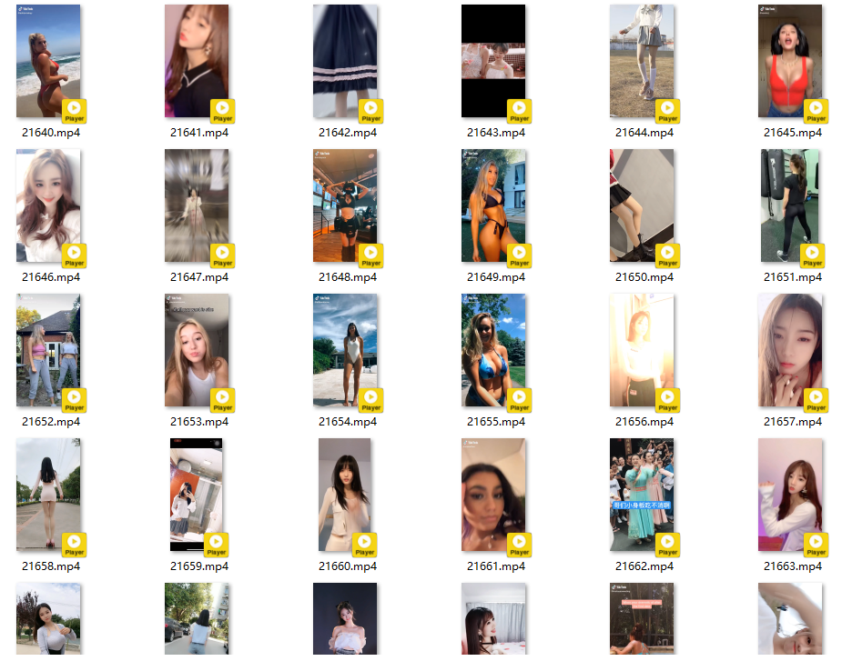

# NiceShortFormVideo

通过几个短视频网址，下载好看的小姐姐短视频，国内外都有。生产者-消费者模式，多线程版。

#### 使用说明

1. 电脑上安装 `Python3.6`及以上版本
2. `CD`到项目根目录内，运行`pip install -r requirements.txt`安装所需库

3. 本程序需要用到数据库，请在`settings.py`中配置自己的数据库`ORM`连接信息
    + 为了简便，可以使用在`uri`注释中写的`sqlite`数据库，该数据库轻便，无需安装数据库软件,`Python`内置`sqlite`包
    + 数据库中表的创建是自动进行的，无需干预
4. 运行命令`python run.py`即可自动下载
5. 使用数据库的目的是防止下载重复的视频，通过网址和视频hash进去重
6. 视频编号是按照下载顺序进行编号的，与数据库中的ID一一对应可通过数据库查看视频的具体信息
#### *Tips*

+ 推荐使用`MySQL`或者`SQLAlchemy`支持的其它数据库(`Oracle`不支持)
+ 其它相关设置，在`settings.py`中均有注释，简单易懂
---
#### **运行结果示例**
+ 随机播放一个视频
+ 

+ 下载的视频集
+ 

#### 一些问题（等有时间一点点解决）
1. 偶尔会有下载完成后程序不能正常结束的问题(可以手动结束)
2. 当线程参数调整过高时，会有少数视频下载不完整的问题

#### **版权声明**
+ 所有资源来自于网络，侵删
---
The end.